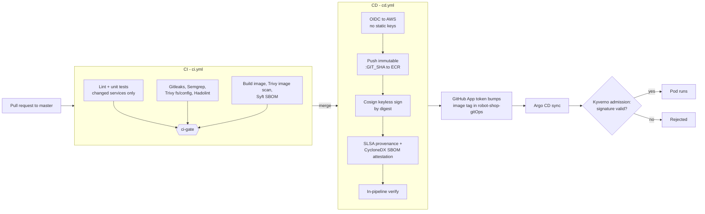

# Robot Shop: a signed, attested CI/CD supply chain on EKS

This is a fork of [instana/robot-shop](https://github.com/instana/robot-shop), a polyglot microservices demo app. **I use it as the workload.** The application code is mostly upstream. **My work is the delivery pipeline around it**: PR security gates, keyless image signing, build attestations, and an automated GitOps hand-off to an EKS cluster that refuses unsigned images.

## The three repos

| Repo | Role |
|---|---|
| **robot-shop** (this repo) | App code + CI/CD pipeline (GitHub Actions) |
| [robot-shop-infra](https://github.com/charliepoker/robot-shop-infra) | Terraform: VPC, EKS, RDS MySQL, ECR, Route 53, ACM, KMS, Secrets Manager, GitHub OIDC |
| [robot-shop-gitOps](https://github.com/charliepoker/robot-shop-gitOps) | Argo CD app-of-apps: platform tools, Kyverno policies, observability, app manifests |

## Pipeline at a glance

Security is checked in two places: in the pipeline, and again at cluster admission. Even if CI were bypassed, an image not signed by this repo's `cd.yml` on `master` would not be admitted.

## What each stage does today

Stated exactly, including what only reports and does not block.

### On every pull request (`ci.yml`)

| Check | Tool | Behaviour  |
|---|---|---|
| Change detection | path filter | Only changed services build, so a PR touching `cart/` doesn't build `shipping/` |
| Lint + unit tests | eslint, ruff, golangci-lint, Maven, phpcs (per language) | **Blocks** via `ci-gate` |
| Secret scan | Gitleaks v8.30.1 | **Blocks** on any finding. Scans the working tree, not full git history |
| Dockerfile lint | Hadolint v2.15.1 | **Blocks** on error-level rules; all findings go to the Security tab |
| SAST | Semgrep (`p/ci` ruleset) | Report-only: findings go to the Security tab as SARIF |
| Deps + config + secrets | Trivy `fs` (HIGH/CRITICAL) | Report-only: SARIF to the Security tab |
| Image scan | Trivy `image` (HIGH/CRITICAL) | Report-only: SARIF to the Security tab, one category per service |
| SBOM | Syft, CycloneDX JSON | One SBOM artifact per service |

`ci-gate` is a single required status check that fails if any upstream job failed. Branch protection requires it.

### On merge to `master` (`cd.yml`)

1. **Authenticate to AWS with OIDC.** No access keys exist in the repo or in GitHub secrets for AWS. The IAM trust policy is scoped to `repo:charliepoker/robot-shop:ref:refs/heads/master`.
2. **Build and push** each changed service to ECR as an **immutable `:<git-sha>` tag**.
3. **Sign by digest** with Cosign keyless (Fulcio certificate, Rekor transparency log). There is no signing key to leak.
4. **Attest**: SLSA build provenance (`actions/attest-build-provenance`) plus a CycloneDX SBOM attestation (`cosign attest --type cyclonedx`).
5. **Verify in the pipeline**: `cosign verify` and `cosign verify-attestation` against the exact workflow identity before anything is promoted.
6. **Hand off to GitOps**: mint a short-lived **GitHub App token** scoped to `robot-shop-gitOps`, update the image reference, and push a conventional commit as `robot-shop-cd[bot]`. No personal access token is used, and app developers have no write access to deployment config.

### At the cluster (in [robot-shop-gitOps](https://github.com/charliepoker/robot-shop-gitOps))

Two Kyverno `ClusterPolicy` resources apply to the `robot-shop` namespace:

- **Signature verification: `Enforce`.** The image must be signed by this repo's `cd.yml` on `master` via the GitHub OIDC issuer.
- **SBOM attestation verification: `Audit`.** Split out on purpose. The CycloneDX SBOM for `ratings` was 2.9 MB, over Kyverno's default 2 MiB admission context limit, which made Argo CD report ComparisonErrors for the whole app. Separating the two policies kept signature enforcement strict while the SBOM check records violations without blocking.

### Pipeline hardening

- `step-security/harden-runner` is the first step of every job (egress policy: audit).
- `zizmor` (v1.29.0) statically analyses the workflow files on any workflow change and reports to the Security tab.
- Dependabot keeps GitHub Actions current via weekly PRs.
- Trivy's action is pinned by commit SHA after the March 2026 tag compromise (CVE-2026-33634).

## The application

Eight services plus a custom MongoDB image, built into ECR by the pipeline.

| Service | Language | Datastore |
|---|---|---|
| cart | Node.js | Redis |
| catalogue | Node.js | MongoDB |
| user | Node.js | MongoDB, Redis |
| web | nginx front end | none |
| payment | Python | RabbitMQ |
| dispatch | Go | RabbitMQ |
| shipping | Java (Spring Boot) | MySQL (RDS) |
| ratings | PHP | MySQL (RDS) |

**What I changed from upstream**

- **MySQL moved to RDS** (MySQL 8.0, provisioned by the infra repo). MongoDB, Redis and RabbitMQ stay in-cluster to keep the demo cheap.
- **Credentials come from the environment.** Upstream hardcodes database passwords in `ratings` and `shipping`. Both now read them from env vars, populated from AWS Secrets Manager through External Secrets. The old values remain only as local `docker-compose` fallbacks.
- **Pipeline files added:** `ci.yml`, `cd.yml`, `workflow-audit.yml`, `dependabot.yml`, `.hadolint.yaml`, `.trivyignore`, `eslint.config.mjs`.

## Limitations and roadmap

I'd rather you read these here than discover them.

- **Several scanners report but don't block yet:** Semgrep, Trivy (fs and image). They surface findings in the Security tab; turning them into hard gates is waiting on triage of the existing findings into `.trivyignore`.
- **Gitleaks scans the working tree, not full history.** History scans were run separately, outside CI.
- **Third-party actions are not all pinned to commit SHAs yet.** Most security-critical ones (Trivy, harden-runner, CodeQL SARIF upload, checkout) are. Several build and attestation actions still use version tags, and Dependabot will keep SHA pins current once they are converted. This is on the list.
- **No OSV-Scanner or `dependency-review` step in CI today.** Dependency CVEs are covered only by Trivy's filesystem scan.
- **Canary delivery is partial.** Argo Rollouts is installed in the cluster, and an analysis template and canary Service are committed, but `web` still runs as a plain Deployment. Finishing the Rollout conversion is next.
- **The cluster is offline.** I tore it down after the observability phase to stop the AWS bill. Reliability hardening, chaos scenarios and a DR restore drill are not done.

## Credits

Fork of [instana/robot-shop](https://github.com/instana/robot-shop) by Instana/IBM, used under the Apache-2.0 license. The sample application and its original documentation belong to its authors.